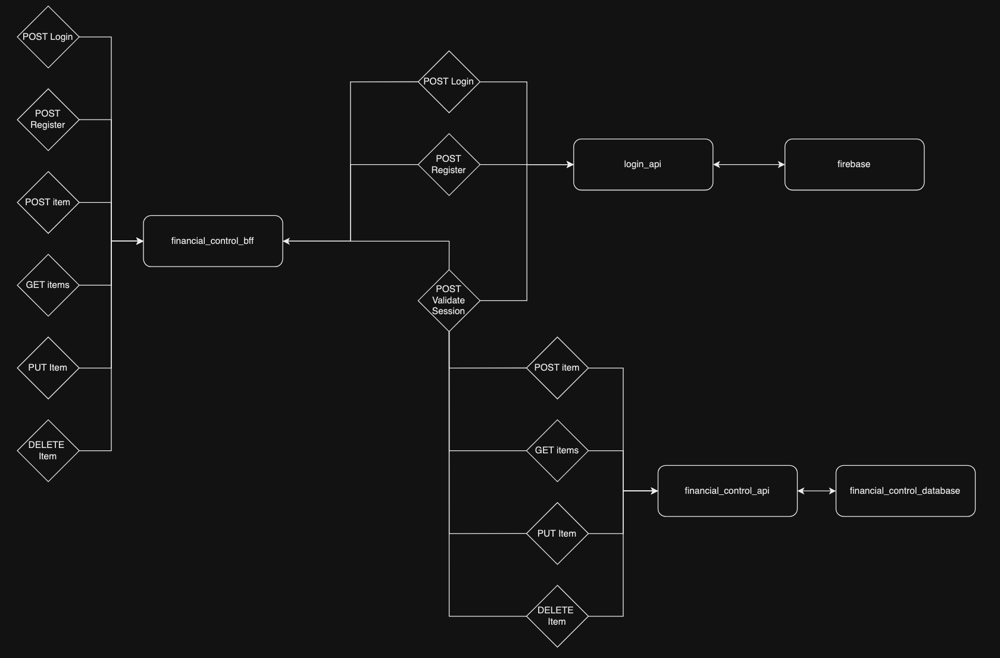

# Financial Control BFF MVP 1

Este pequeno projeto é a primeira versão do BFF do MVP do Financial Control

O objetivo do projeto é um "backend for front end" responsável por organizar todas as apis necessárias do Financial Control voltadas para a organização financeira, sendo agrupadas por usuários, meses e anos. Devolvendo seus resultados para a aplicação que está implementando a api de BFF com as 6 rotas.

**POST LOGIN**: Uma rota para registro de usuário, ela recebe um json com email e senha para efetuar a criação de usuário em uma roda POST.

**POST REGISTER**: Uma rota para login do usuário, ela recebe um json com email e senha para efetuar o login do usuário em uma roda POST, retornando seu id e token de sessão.

**GET BILL ITEMS**: Uma rota para buscar as contas do mês e ano do usuário.

**POST BILL ITEMS**: Uma rota para salvar a conta do mês e ano do usuário.

**PUT BILL ITEMS**: Uma rota para editar a conta do mês e ano do usuário.

**DELETE BILL ITEMS**: Uma rota para deletar a conta do mês e ano do usuário.

---
## Antes de Executar

Para entender como funciona o BFF do financial control, primeiro deve-se entender que o projeto não roda como uma api sozinha, ele precisa das apis de [login](https://github.com/TiagoLinharess/financial-control-login-mvp-1) e [repositório](https://github.com/TiagoLinharess/financial-control-api-mvp-2) nas portas 3000 e 5002 respectivamente, instaladas e rodando, seguindo o fluxograma abaixo.

**OBS:** Todos os requests na api do financial control passam por uma rota não exposta no bff para verificação de sessão na api de login.



## Como Executar

Será necessário ter todas as libs python listadas no `requirements.txt` instaladas, é bem simples o processo.

Após clonar o repositório, é necessário ir ao diretório raiz do projeto, pelo terminal, para poder executar os comandos descritos abaixo.

Criação do env

```bash
python -m venv env
```
Inicialização do env

```bash
source env/bin/activate
```
Instalação das dependências

```bash
(env)$ pip install -r requirements.txt
```

Para executar a API  basta executar:

```
(env)$ flask run --host 0.0.0.0 --port 5000
```

Em modo de desenvolvimento é recomendado executar utilizando o parâmetro reload, que reiniciará o servidor
automaticamente após uma mudança no código fonte. 

```
(env)$ flask run --host 0.0.0.0 --port 5000 --reload
```

### Executando com Docker

Criação da rede (Necessária para se comunicar com as outras apis)

```bash
docker network create financial-control-network 
```

Criação da imagem:

```bash
docker build -t financial-control-bff .
```

Execução da imagem:

```bash
docker run -d --name financial-control-bff --network financial-control-network -p 5000:5000 financial-control-bff
```